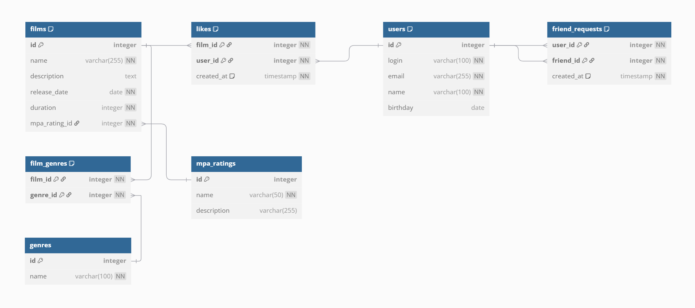

# java-filmorate

--Получение всех пользователей
SELECT 
	u.id,
	u.login,
	u.email,
	u.name,
	u.birthday
FROM users u

--Получение всех фильмов
SELECT 
	f.id,
	f.name,
	f.description,
	f.release_date,
	f.duration
FROM films f;

--Получение фильма по id
SELECT 
	f.id,
	f.name,
	f.description,
	f.release_date,
	f.duration
FROM films f
WHERE f.id = входной id;

--Получение 10 самых популярных фильмов
SELECT 
    f.id,
    f.name,
    f.description,
    f.release_date,
    f.duration,
    COUNT(l.id) AS likes_count
FROM 
    films f
LEFT JOIN 
    likes l ON f.id = l.film_id
GROUP BY 
    f.id, f.name, f.description, f.release_date, f.duration
ORDER BY 
    likes_count DESC
LIMIT 10;
